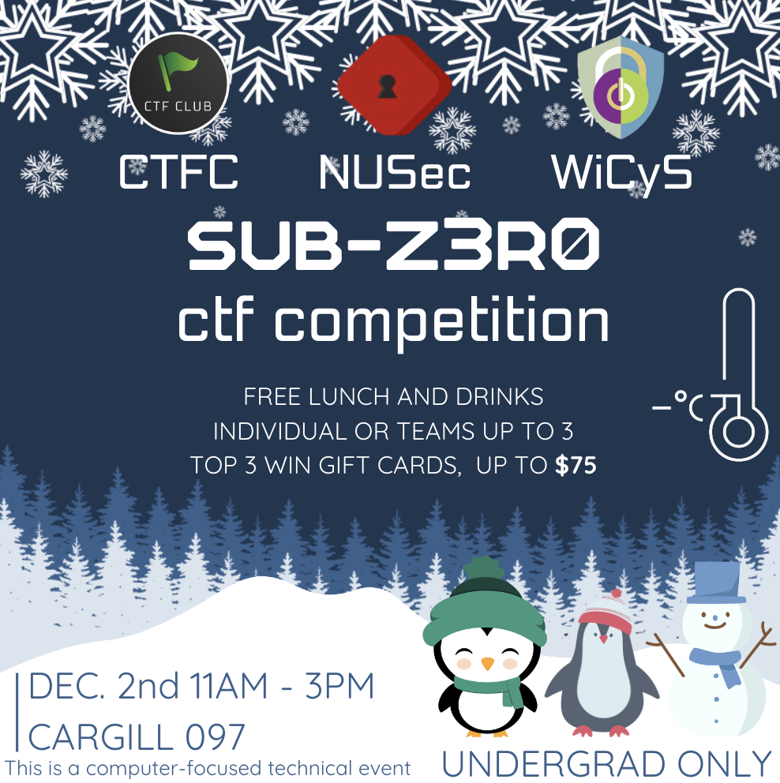
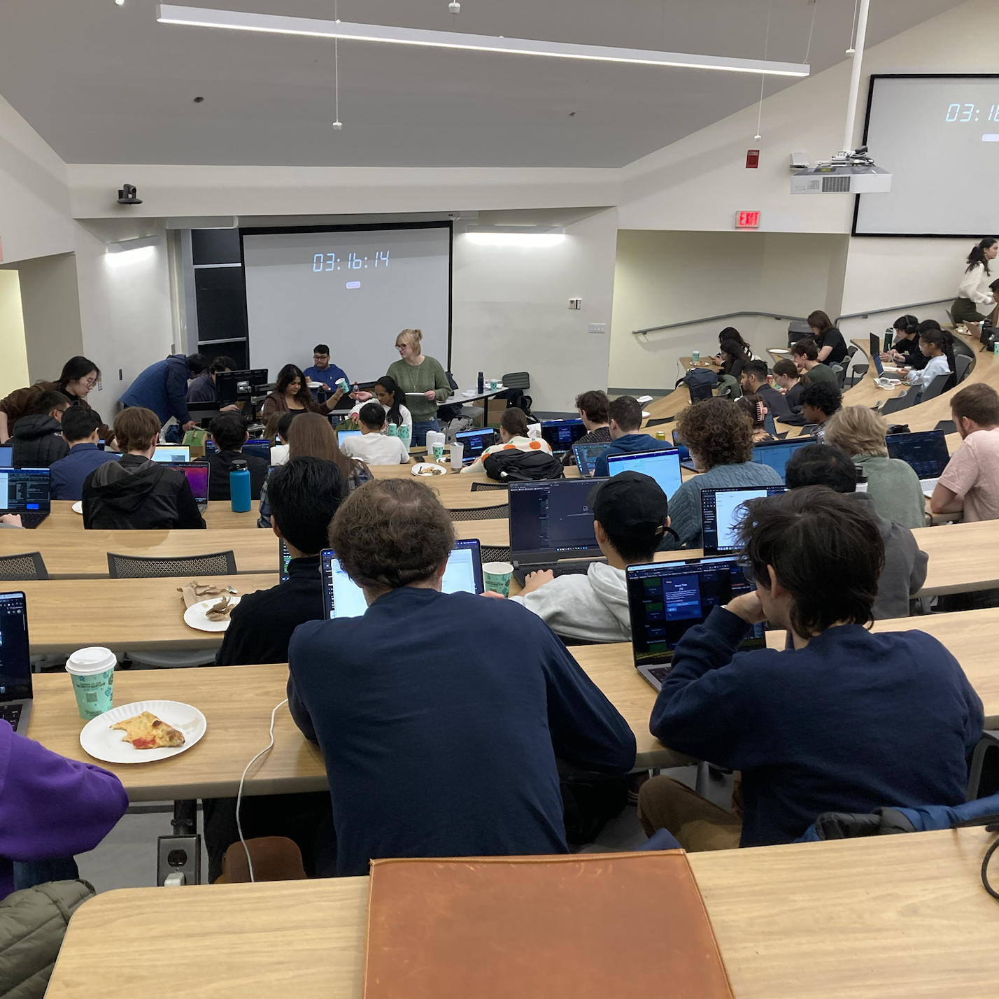
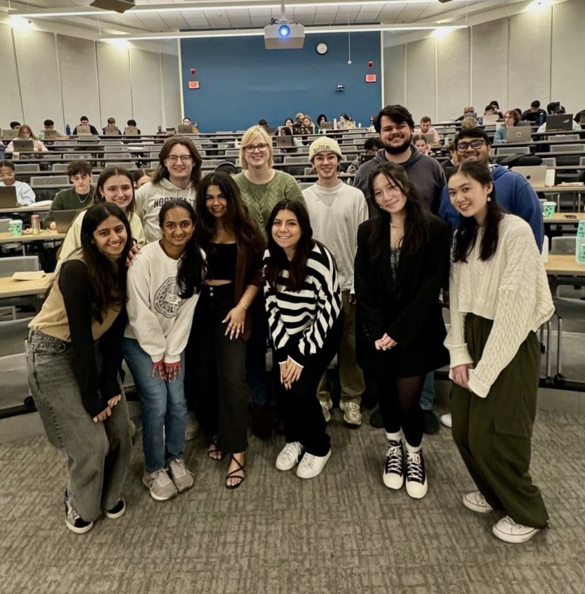

NU Security, NU WiCYS and NU CTF are so excited to announce the biggest student-led security event at Northeastern! We present to you: The SUB-Z3R0 CTF! This CTF is open to all undergraduate students who are interested, regardless of their experience level. Compete solo or with a team in engaging security challenges. Lunch will be provided, and winners can earn up to $75 in gift cards! Registration closes on November 28th, click the link in any of our Instagram bios to register today!

---

