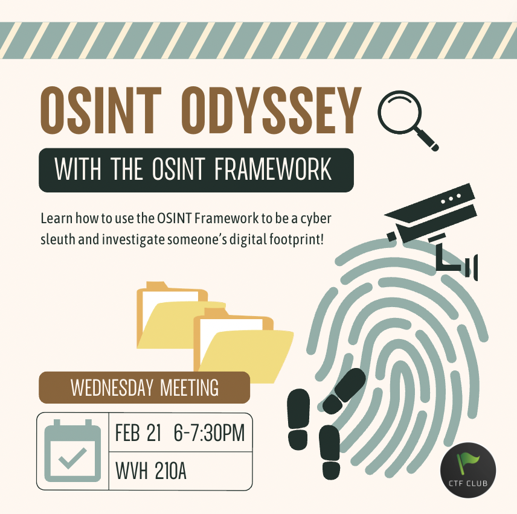
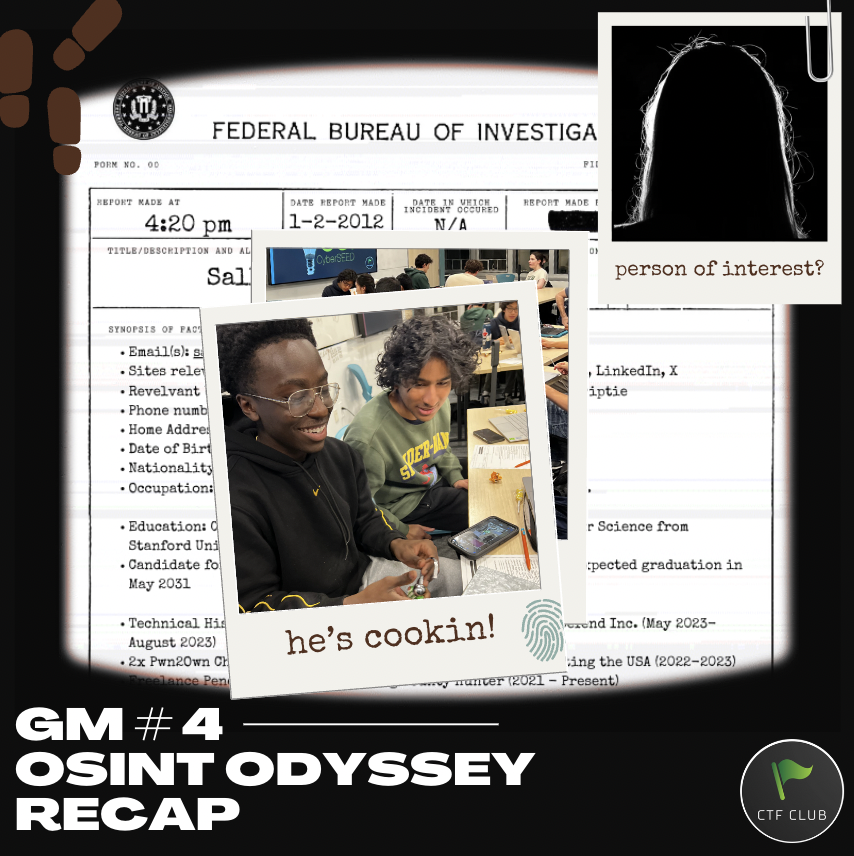
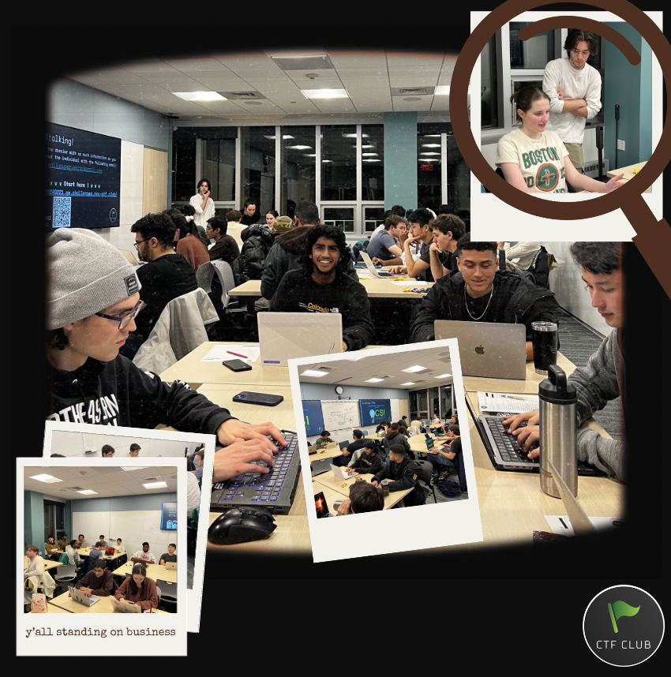

hi hackers! Join us as we use our ultimate stalking… I mean investigation skills with the OSINT framework. We’ll go over some tried and true strategies for information-gathering. In today’s data-driven world, knowledge truly is power. We’ll teach you how to ethically collect, analyze, and leverage open-source intelligence to gain valuable insights, mitigate risks, and make smarter decisions. Our workshop offers something for everyone, so don’t miss this opportunity to elevate your understanding of OSINT and stay ahead in today’s information age.

---

