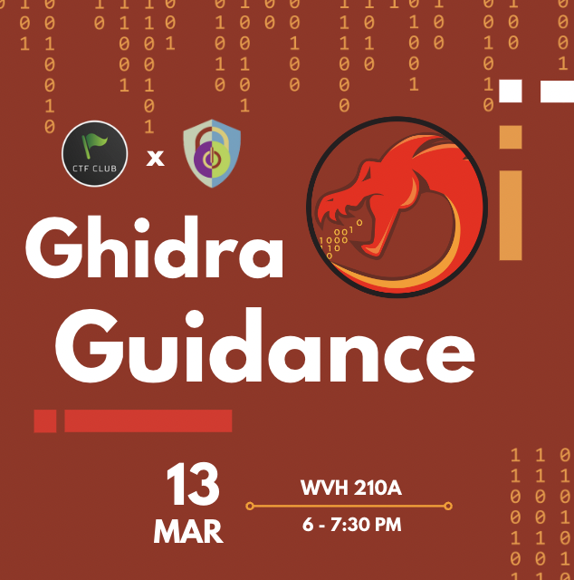
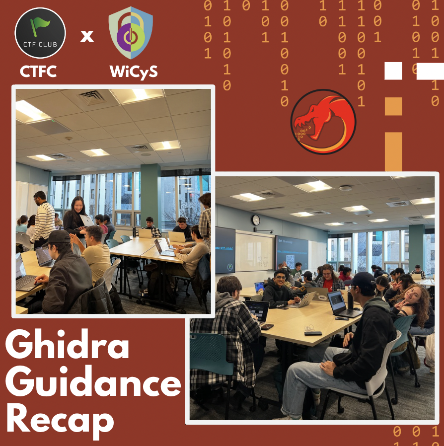
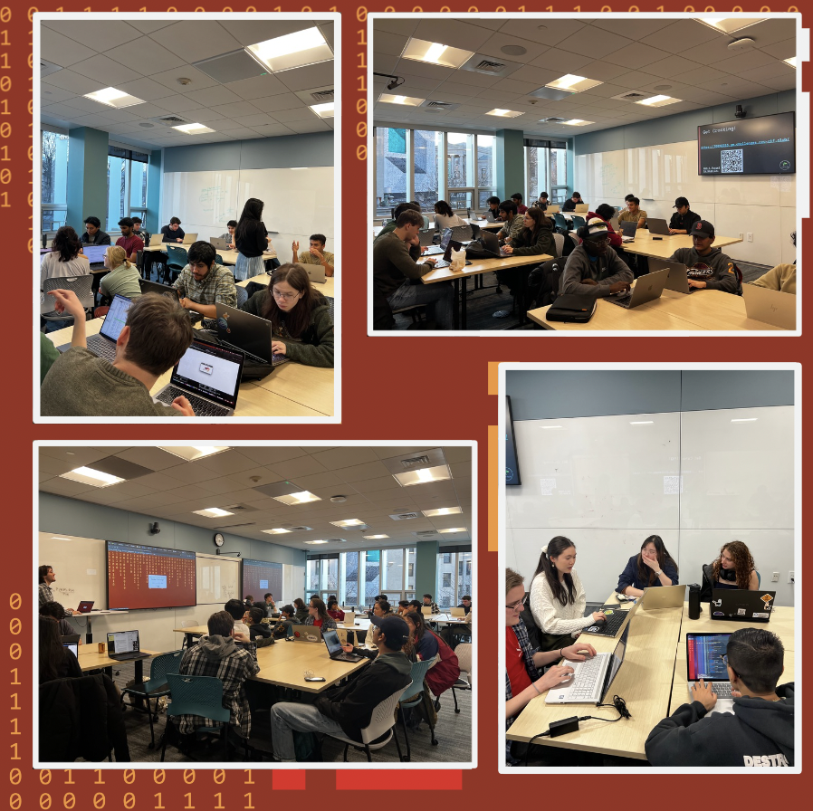

Hi hackers! Join CTFC x WiCyS THIS WEDNESDAY as we hone in on Ghidra and its elite capabilities. Developed by the NSA and released as an open-source software, Ghidra has broken down barriers to entry in the field of reverse engineering. Anyone can access this powerful reverse engineering tool without dropping a bag. Ghidra offers a comprehensive suite of tools for analyzing binaries, disassembling code, and exploring executables. It provides the tools necessary to tackle even the most complex reverse engineering challenges. Learn how to analyze and dissect malware, vulnerabilities, and other threats with precision and accuracy at our event.

PLEASE INSTALL GHIDRA BEFORE PULLING UP TO THE EVENT—- thanks!

… we’ll also help out installing during the meeting if you need help :D

---

